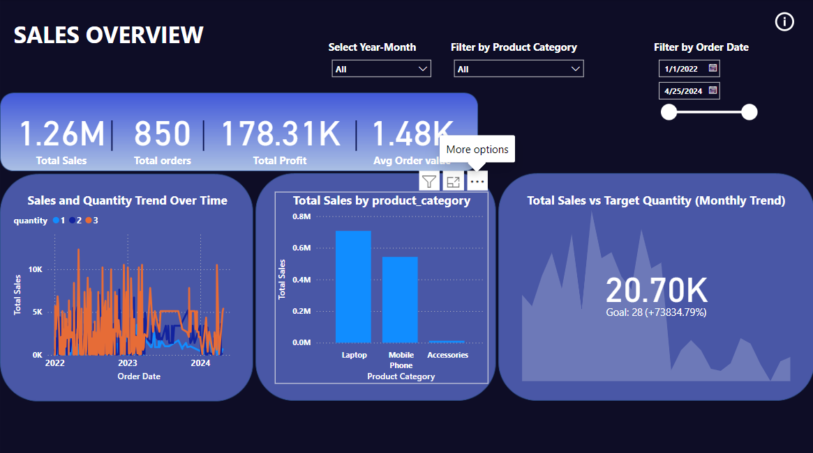
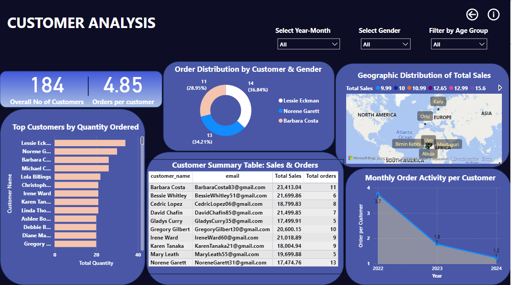
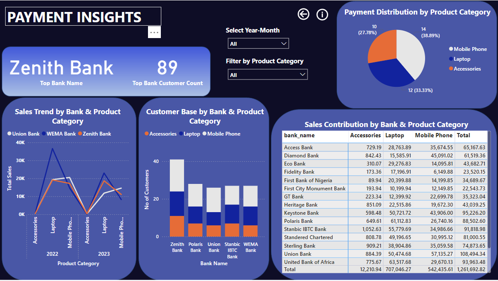
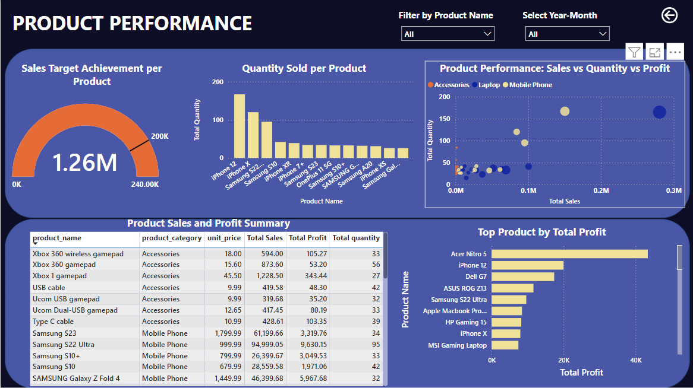

# Retail Sales and Payment Analysis

This project involves end-to-end data analysis of a retail store's sales and payment data. 
I used Python for data cleaning, PostgreSQL for data transformation and integration, and Power BI for interactive dashboard visualization.

## 🔧 Tools Used
- Python (Pandas, Regex)
- PostgreSQL (data preparation)
- Power BI
- Microsoft Excel
- Github (version control)

## 🧰 Project Steps
1. Cleaned and transformed Excel data using Python.
2. Loaded cleaned data into PostgreSQL.
3. Used SQL to join and aggregate data across orders, products, customers, payments, and credit cards.
4. Visualized insights such as total revenue, products performance, customer analysis, and payment insights using Power BI dashboards.

## 📊 Key Insights
- Total Sales vs Target Quantity (Monthly Trend)
- Payment Distribution by Product Category
- Product Performance: Sales vs Quantity vs Profit
- Sales Trend by Bank & Product Category

## 📁 Files Included
- [`retail_analysis.py`](../retail_analysis.py/retail_analysis.py) – Python data cleaning script
- [`retail_queries.sql`](../retail_queries.sql/create_sales_report_table.sql) – PostgreSQL data transformation queries
- Dashboard screenshots (, , , )

## Author
**Ernest Yesufu**
Data Analyst | SQL, Python, Excel & Power BI
Based in United Kingdom

## 🔗 Live Portfolio View
(https://ernestyesufu.github.io/)
